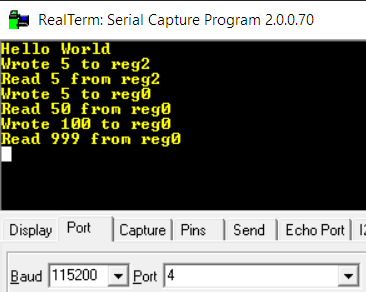

# FPGA implementation of TIS100 T21 Node

This project implements the processor from the game <http://www.zachtronics.com/tis-100/> in an FPGA. Specifically this is an effort to build it in the Xilinx Vivado tool chain with as close an adherence to the game behavior as possible.

The T21 node is the in game name for the processor that you're programming for the TIS100 system.

This project was tested with a <http://zedboard.org/product/microzed>. This board uses a Zynq 7Z020 to allow communication between an FPGA and a ARM processor.

For a blog post on some of the design and debug process, check out <https://www.robopenguins.com/tis100-on-fpga/>

# Prior Work

My main resource was the links in <https://tis100.complexity.nl/links.html>. It had pretty much all the resources I'd need along with source for a bunch of emulators.

When I moved to using a block design in the project I used scripts created by marcel42 https://forums.xilinx.com/t5/Vivado-TCL-Community/Using-version-control-with-Vivado-in-project-mode/td-p/863202

# Progress

Currently this codebase can generate a Vivado project that can run simulations of a grid of T21 nodes or run in realtime with a single node acting as a coprocessor to an ARM CPU. The nodes are functional and should be exactly faithful in behavior to the game implementation. The one missing feature is the that the virtual ports ANY and LAST aren't supported. While I think it's possible to implement their behavior, it would require a much more complicated design.

Here's the schematic for the code:

<a href="docs/t21_schematic.png"></a>

In addition I've written a series of python scripts to aid in development and testing. These include:

 * A compiler to take the code you write in the game and compile it to binary that can be loaded into the hardware memory.
 * A basic emulator for running TIS code in Python
 * Tools for generating stimuli and verification data for the FPGA simulation unit tests

An example simulation is running the following code in a single node:

```
MOV UP ACC
L1: SWP
ADD 10
SWP
SUB 1
JNZ L1
SWP
MOV ACC DOWN
```

Feeding in [5, 100] gives the output [50, 999] in the behavioral simulation. Here's a waveform of some of the nets during the 5x10 calculation:

<a href="docs/mult_sim.png"></a>

I also tested that this code could run in realtime on my Microzed board. Here you can see the serial output when the CPU sends the input into a wrapper for the TIS100 node.

<a href="docs/good_serial_out.png"></a>

[](https://www.youtube.com/watch?v=WQfV7bC7NvE)

Another simulation is able to correctly solve the 6th puzzle in the game "Sequence Generator" using two nodes.

The code and input:

<a href="docs/sig_gen_ex.png"></a>

The first 7 outputs from the simulator:

<a href="docs/sig_gen_sim.png"></a>

# Instruction Format

I created my own binary representation of the TIS100 instructions. The format is (len in bits):

`[4 op][3 src][11 const][3 dst] = 21 bits`

 * op denotes the type of operation
 * src is the source register
 * const is a constant immediate value (for example the 5 in `ADD 5`)
 * dst is the destination register

All jump instructions use the const field to give the absolute address to jump to.

See [compiler source](scripts/compiler.py) for more details

# Usage

This project targets [Xilinx Vitis + Vivado](https://www.xilinx.com/support/download/index.html/content/xilinx/en/downloadNav/vitis.html) version 2019.2 .

I was doing development from windows, but I used Git Bash as the terminal since I'm more comfortable scripting in Bash than Batch Script. These scripts should work with minor modification on Linux, or you can use a similar setup on Windows. I adapted the scripts from https://forums.xilinx.com/t5/Vivado-TCL-Community/Using-version-control-with-Vivado-in-project-mode/td-p/863202 once I added the complexity of managing design block files.

Some of the scripts assume you have Python3, Vitis, and Vivado bin directories added to the PATH environment variable.

## To generate the Vivado project

`sh from_git.sh`

This creates a directory `tis100/`. To rerun the build script you must first delete this directory. You can then open the Vivado project and use the GUI.

## To run the unit tests

`./scripts/run_tests.sh`

This will run the Xilinx simulator from Vivado in the command line and report the results of the unit tests.

Each test tests one of the modules. Most have a corresponding python script that generates the waveform used for validation.

## The compiler

```
usage: compiler.py [-h] [-t {memh,memb,csvb,coeh,pick}] [-o OUT_FILE] asm_file

Compile TIS asm to binary opcodes

positional arguments:
  asm_file              Input TIS asm path

optional arguments:
  -h, --help            show this help message and exit
  -t {memh,memb,csvb,coeh,pick}, --type {memh,memb,csvb,coeh,pick, cu32}
                        sets output type
  -o OUT_FILE, --out_file OUT_FILE
                        sets output file path
```

The compiler currently only takes TIS100 assembly files for a single node. It does basic validation and error checking. 

The current output formats are:

 * memh - hex memory file for Verilog, see [here](https://timetoexplore.net/blog/initialize-memory-in-verilog)
 * memb - binary memory file for Verilog, see [here](https://timetoexplore.net/blog/initialize-memory-in-verilog)
 * csvb - memb, but each portion of instruction separated by comma
 * coeh - Xilinx coefficients file, see [here](https://www.xilinx.com/support/documentation/sw_manuals/xilinx11/cgn_r_coe_file_syntax.htm)
 * pick - python pickle used for emulator
 * cu32 - a c array of 32 bit unsigned values. This is used to load instruction onto the TIS100 from the ARM CPU.

For example to compile the multiplier code for the emulator:

`python ./scripts/compiler.py -t pick -o data/test_mult.p data/test_mult.tis`

## The emulator

This is a pretty bare bones implementation for testing purposes. Right now the instructions, node layout, and input and output streams are hard coded in the main function.

It can load the compiler output and prints the register state for each time tick.

## Real hardware

To run on real hardware:
1. Generate the Vivado project using `from_git.sh` as mentioned above.
2. Generate the bitstream and export the hardware design. Run `sh scripts/generate_bitstream.sh` or open the generated Vivado project and and use the UI.
3. Create a Vitis workspace by running `sh src/sdk/make_workspace.sh` 
4. Open the generated workspace in Vitis and build the project.
5. Copy the `BOOT.BIN` to an empty FAT formated SD card, and make sure the jumpers are in the correct position for an SD card boot.
6. Connect the MicroZed to the PC with the USB cable, and connect to the COM port with a serial terminal at 115200 baud. Then press the usr button and see the results output over serial.
7. To run with JTAG connect a Digilent HS2 to the Microzed. Click on the dropdown next to run and open `Run Configurations`. Create a new `Single Application Debug` and run.

# Next Steps

- [x] Connect multiple nodes together using top level design file
- [x] Connect to ARM in Zynq SoC over AXI (use as co-processor)
- [x] Have ability to load code
- [x] Be able to wire up in Xilinx Block designer
- [ ] Set up a monitoring/control UI
- [ ] Build from Lua Script

# Misc Todo

- [ ] Refactor Testbenches to use tasks for code reuse
- [ ] Add ANY and LAST targets for data (use 4 cycles to avoid multiple writes or reads to same node)
- [ ] Improve testbench simulations to avoid needing to fully recompile each time (compile library?)
